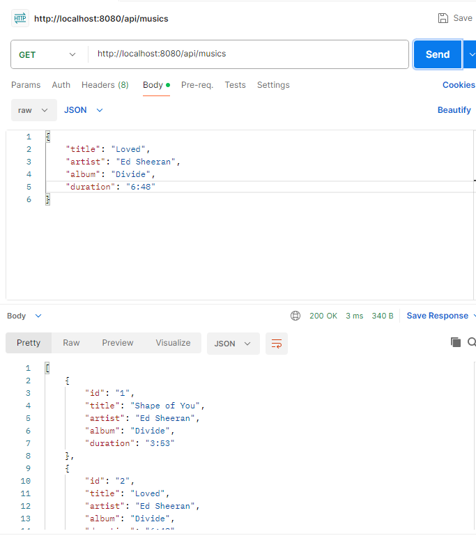
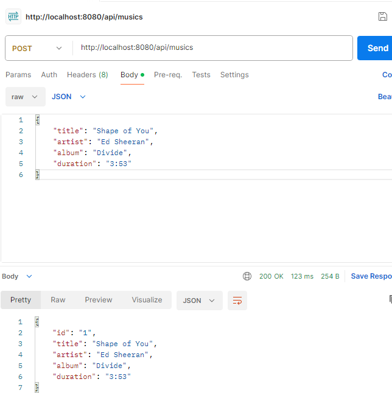
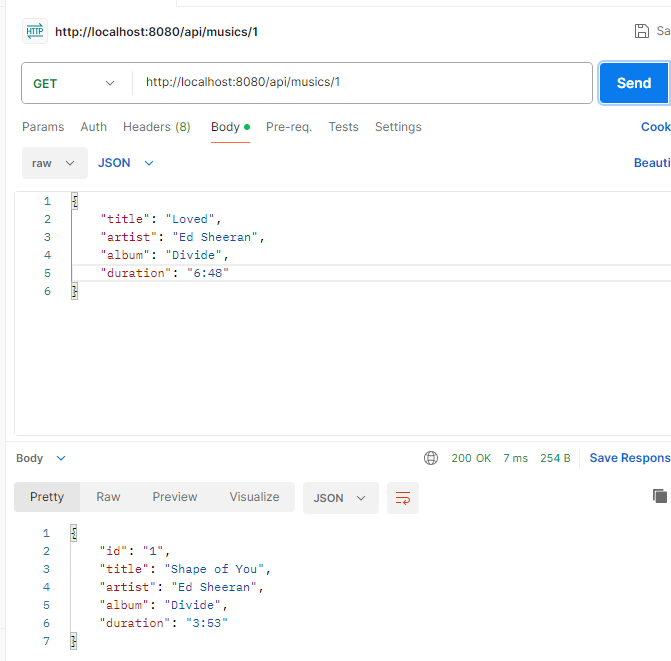
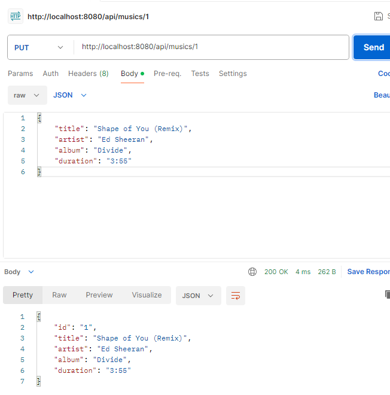
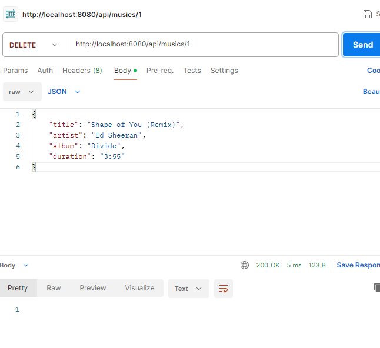

# API de Playlist - Spring Boot Demo

## Endpoints

### GET /api/musics
- Retorna a lista de músicas disponíveis.
- **Exemplo de Requisição no Postman**:

### POST /api/musics
- Cria uma nova musica.
- {
    "title": "Shape of You",
    "artist": "Ed Sheeran",
    "album": "Divide",
    "duration": "3:53"
}
- **Exemplo de Requisição no Postman**:

### GET /api/musics/{id}
- Retorna os detalhes de um música específico pelo seu ID.
- **Exemplo de Requisição no Postman:**

### PUT /api/musics/{id}
- Atualiza os detalhes de uma música existente.
- **Exemplo de Requisição no Postman:**

### DELETE /api/musics/{id}
- Remove uma musica da playlist pelo seu ID.
- **Exemplo de Requisição no Postman:**

---

